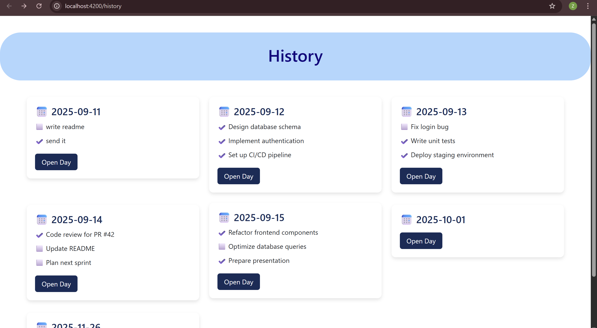
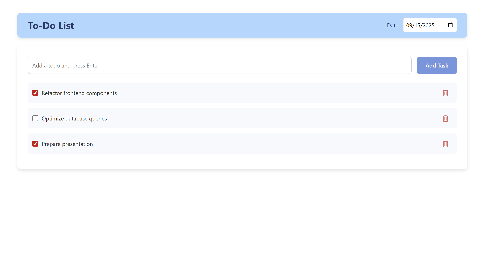

# TODOList – Simple Task Manager

A simple daily task manager application built with **Angular** for the frontend and **Node.js + Express** for the backend. Data is stored in a **JSON file**, simulating a lightweight database.

---

## Tech Stack
- **Frontend:** Angular
- **Backend:** Node.js + Express
- **Storage:** JSON file

---

## Features
- ➕ Add new tasks for each day
- ✏️ Edit tasks inline
- ❌ Delete tasks
- ✅ Mark tasks as completed or pending
- 📂 View daily history and open specific days with the **Open Day** button
- 📅 Add a new day using a calendar picker

---

## Project Structure  

## How to Run

### 1. Clone the repository
<pre>
git clone https://github.com/your-username/todoapp.git

</pre>
### 2. Install dependencies
Backend:
<pre>
npm install
</pre>
Frontend:
<pre>
npm install
</pre>
### 3. Run the backend
<pre>
npm start
Backend runs on: http://localhost:3001
</pre>

### 4. Run the frontend
<pre>
ng serve
Frontend available on: 
http://localhost:4200 </pre>

## Pictures

#### History Page

#### To-Do List Page
  